# 火车票务管理系统 — 核心流程图

## 1. 登录与身份验证流程

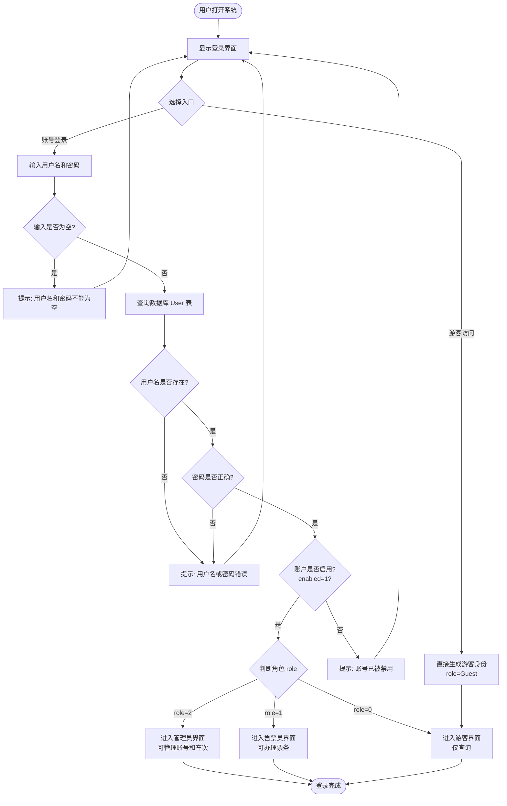

## 2. 管理员 — 用户新增流程

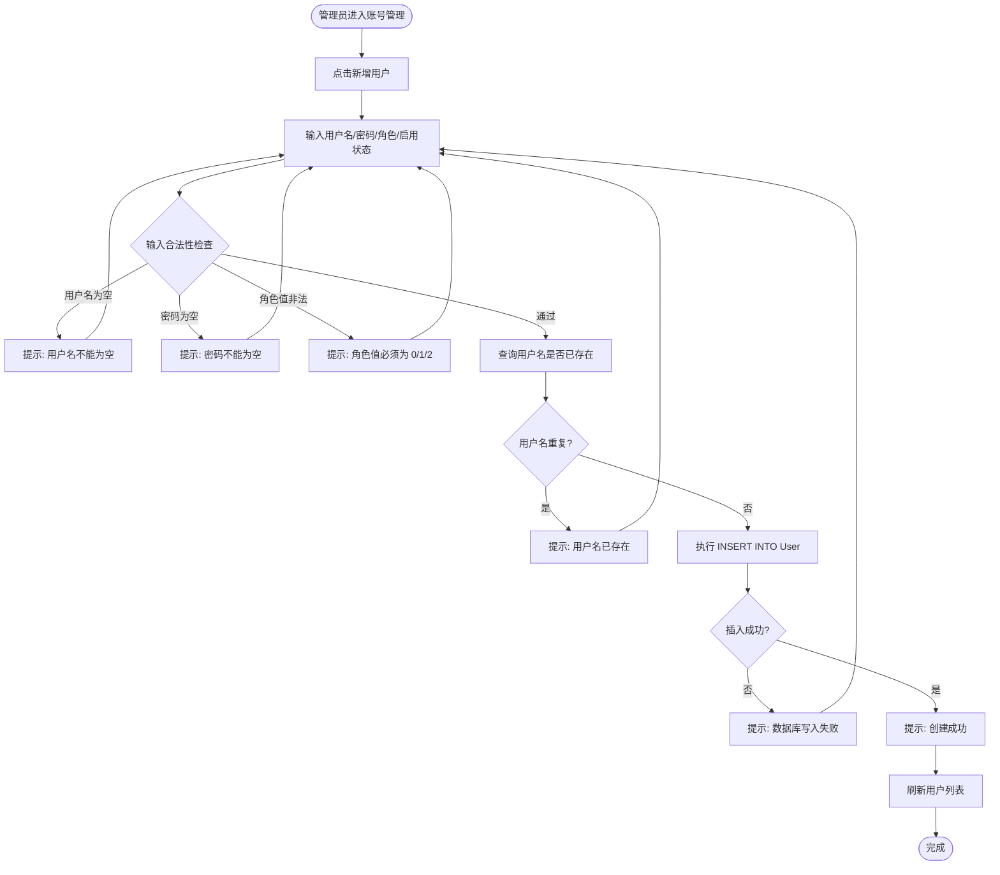

## 3. 车次新增流程

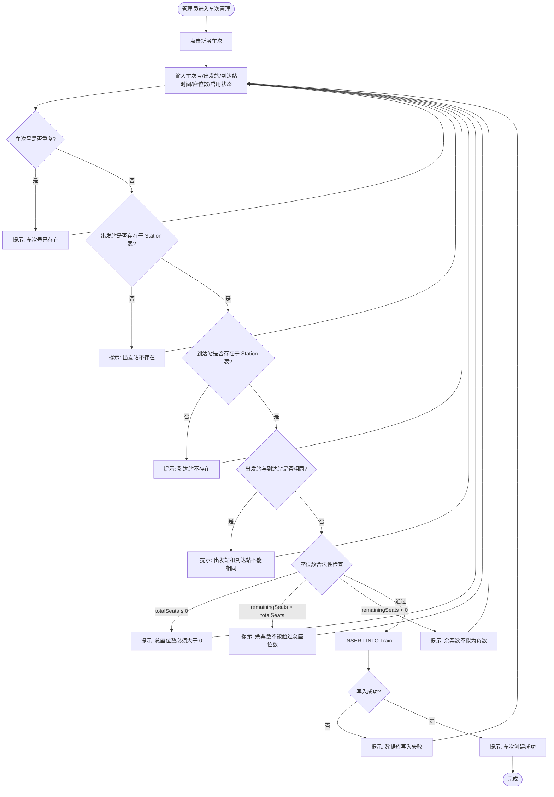

## 4. 车次查询与修改流程

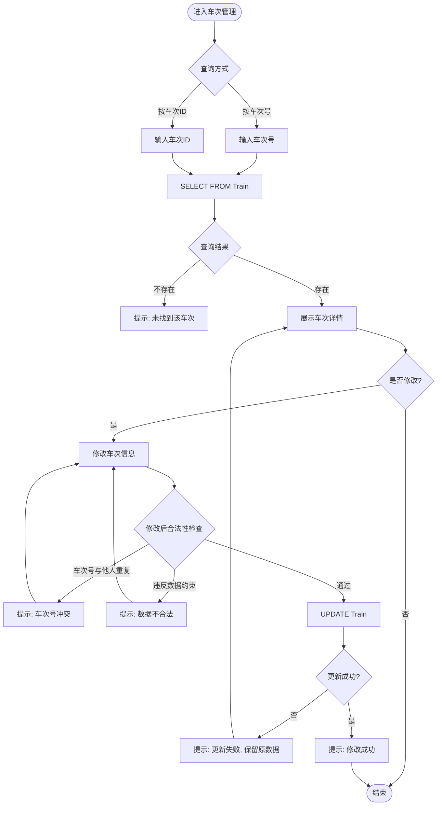

## 5. 订单创建流程（订票）⭐ 核心

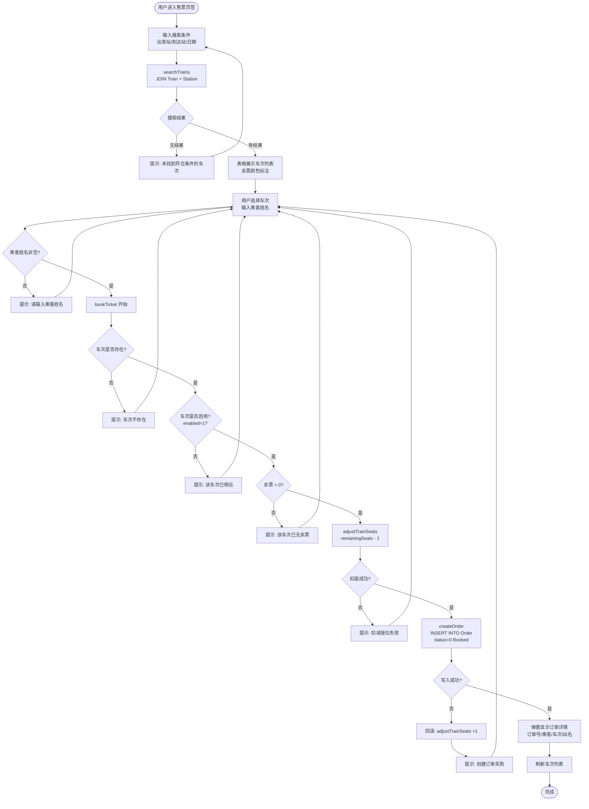

## 6. 退票流程

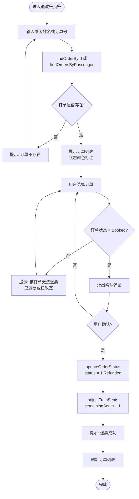

## 7. 改签流程

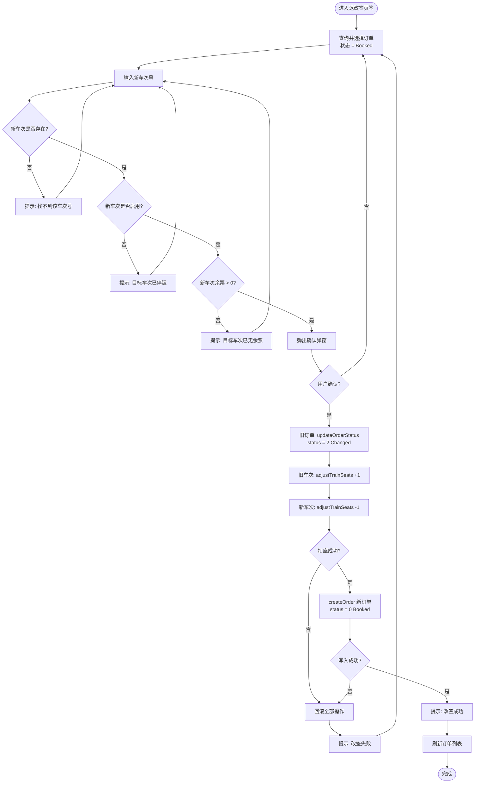

## 8. 订单查询与历史流程

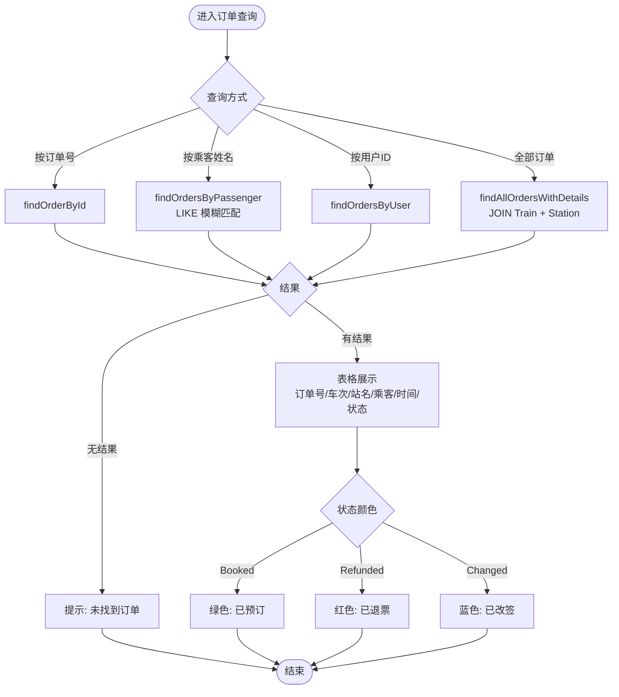

## 9. 统计信息流程

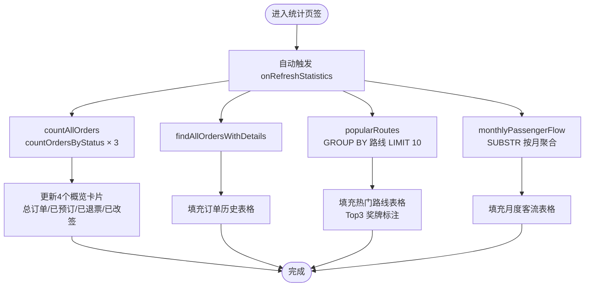

## 10. 保存退出流程

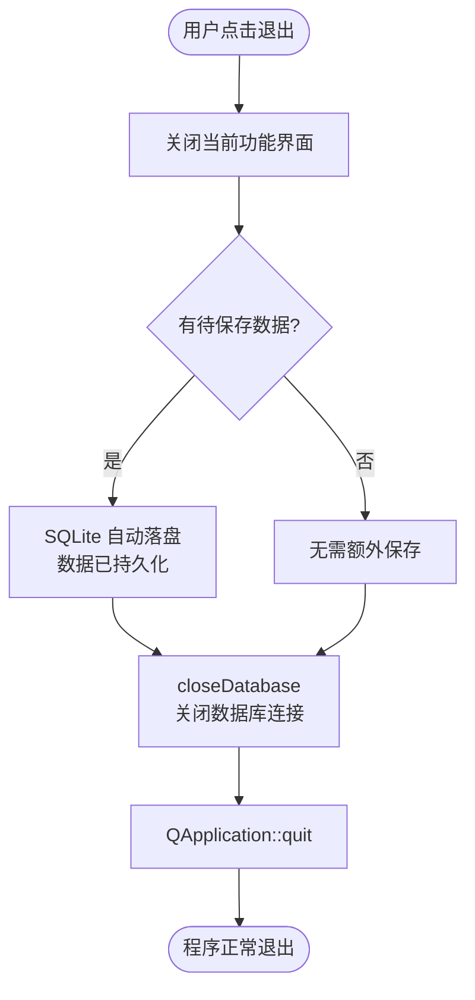

---

## 系统总览架构图

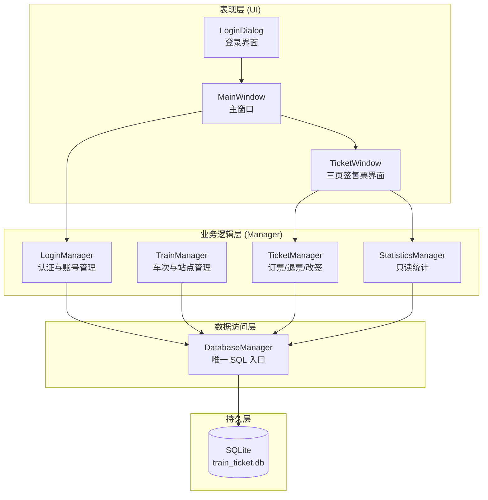

## 数据库 ER 图

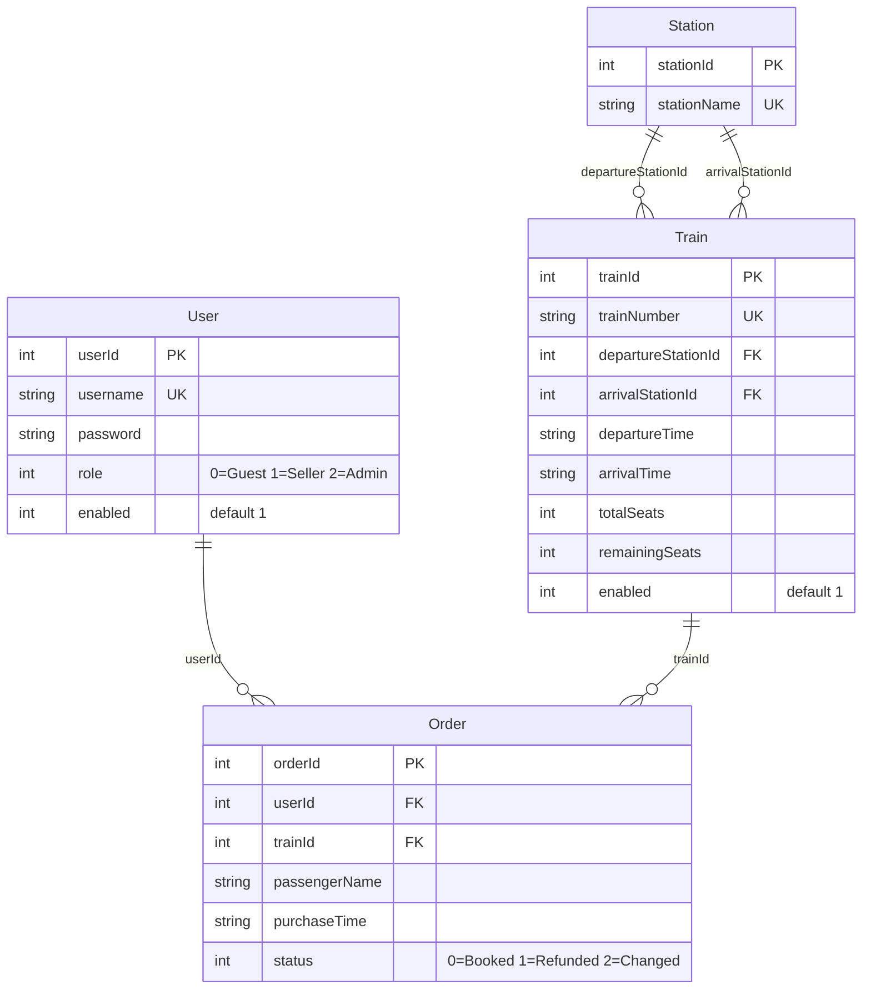
